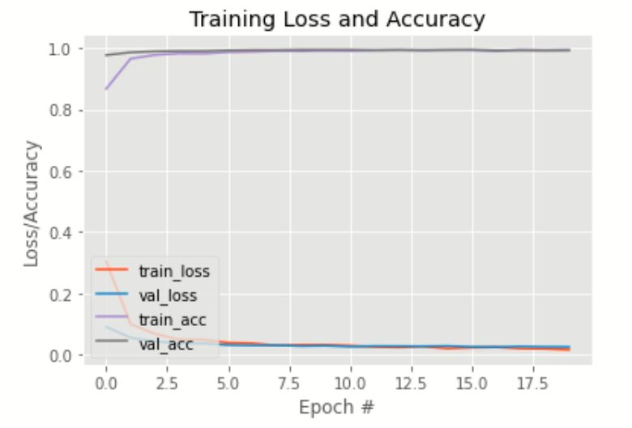
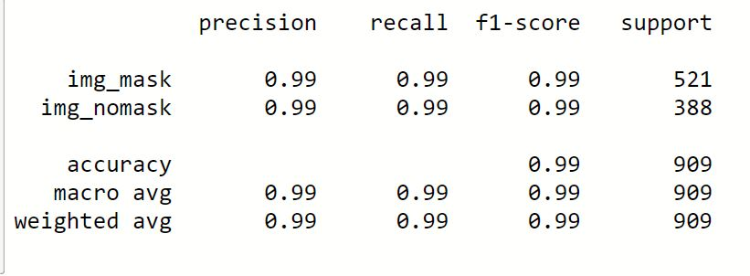

# Covid_face_mask_detector using CNN, Mobile_Net  and  Tensor flow

## Dependencies :
Python 3.7

Keras 2.2.4 conda install keras=2.2.4

Tensorflow 1.15 conda install tensorflow-gpu=1.15 or conda install tensorflow

OpenCV-python

ImageDataGEnrator

NumPy

OS

MobileNetV2

## Dataset :

I have created the dataset for this project and i have divided it into divided into two categories ie "img_mask" and "img_nomask" and stored into RESORCE folder.

I downloaded the images for both categories from internet and saved them in respective folder in the system.

Totally I have 4541 images beacuse we need to get highly accurate model..

img_mask = 2605

img_nomask = 1936

## Pre-requsite:

All the dependencies and required libraries are included in the file requirements.txt

## Features.

My face mask detector didn't uses any morphed masked images dataset.

The model is accurate, and since we used the MobileNetV2 architecture, 

it’s also efficient and thus making it easier to deploy the model 

Model accuracy is 0.99

## Report on Model Accuracy

### Classification report

## Procedure for usage: 

Install Anaconda(Python 3.7) & Tensorflow GPU (I used 1.15 TF)

Then Download this Repository via GIT or zip.

Already i have trained model and uploded  in my repository as covid_mask_detector.model

Now copy covid_mask_detector.model and Covid_FaceMAsk_detect.ipynb 

Then copy my files to the local disk were jupyer or anaconda navigator is installed

Now run the ipynb file via jupyter it will open your webcam and it will start detection.

## RESULTS 

### For futher Queries contact me at:
vineeth.artifintell@gmail.com

